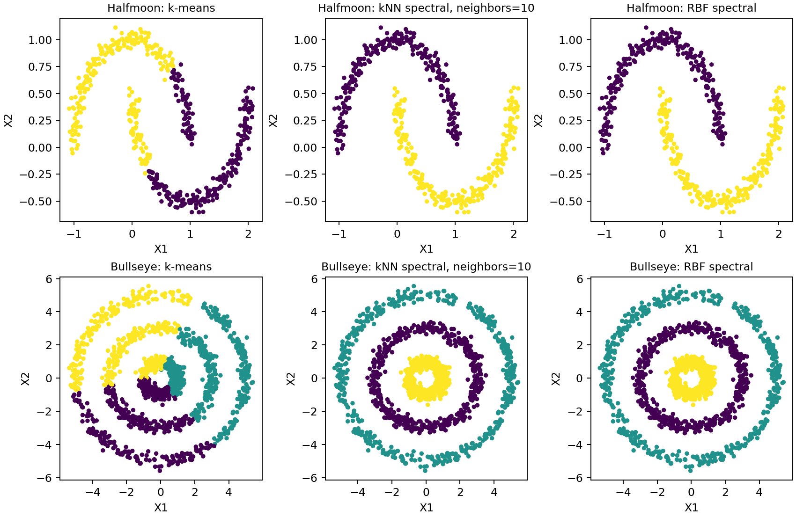

# Spectral Clustering for Nonlinear Structure

Compare Euclidean k-means with graph-based clustering on two moons and concentric rings.

**Author:** Heyang Ma · Independent UCLA graduate course project, revised for this portfolio.
**Tools:** Python / SciPy, Graph Laplacians, Clustering diagnostics. **Scope:** Two synthetic benchmark datasets.

## Question

When does a graph representation recover nonlinear cluster geometry that k-means misses?

## What I did

I implemented normalized graph-Laplacian clustering, compared it with k-means, and reported adjusted Rand index, graph connectivity, and isolated-node diagnostics across a neighbor grid.

## Main finding

At 10 neighbors, normalized spectral clustering achieved ARI 1.0 on both supplied datasets, compared with 0.253 and 0.004 for k-means. The neighbor grid is reported in full, including disconnected-graph diagnostics. These are descriptive benchmark scores, not held-out performance.



_K-means and normalized spectral-clustering assignments on the two supplied datasets._

## Important limitations

The number of clusters is known for these teaching examples. ARI uses the provided reference labels for evaluation. Affinity choices matter, and perfect recovery of these examples is not evidence of broad generalization. Dense eigendecomposition is not designed for large datasets.

## Code and reproducibility

Install Python dependencies with `python -m pip install -r requirements.txt`.
Read [data access and input requirements](DATA_ACCESS.md), then run from this repository:

```sh
python analysis.py --halfmoon data/halfmoon.csv --bullseye data/bullseye.csv --output results
```


The executable analysis is [analysis.py](analysis.py). See [REPORT.md](REPORT.md) for model details and interpretation, [DATA_ACCESS.md](DATA_ACCESS.md) for inputs, and [REVISION_NOTES.md](REVISION_NOTES.md) for the distinction between the course project and portfolio revision. The committed `results/` files are generated summaries from the revision.

## Checks

Run `python -m unittest test_analysis.py`. These tests cover the corrected failure cases; they do not replace statistical validation.
